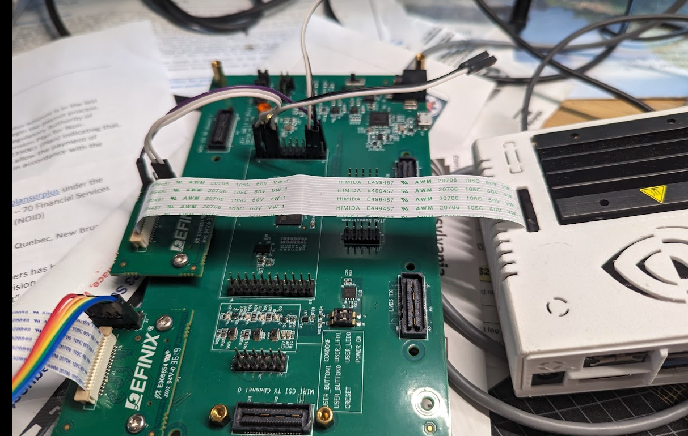

# camera_mockup
jetson nano + efinix t20 mipi, mocking up imx219 sensor in T20 and sending data over MIPI CSI2 link

connect i2c slave with jumper wires, on Jetson i2c is 3.3 levels.

Camera needs to be detected at boot time. Does not support hot plug in Linux.

[linux commands](readme/memo.txt)

[comm traces from total phase beagle](readme/arducam%20imx219%20jetson%20startup%20only.tdc)